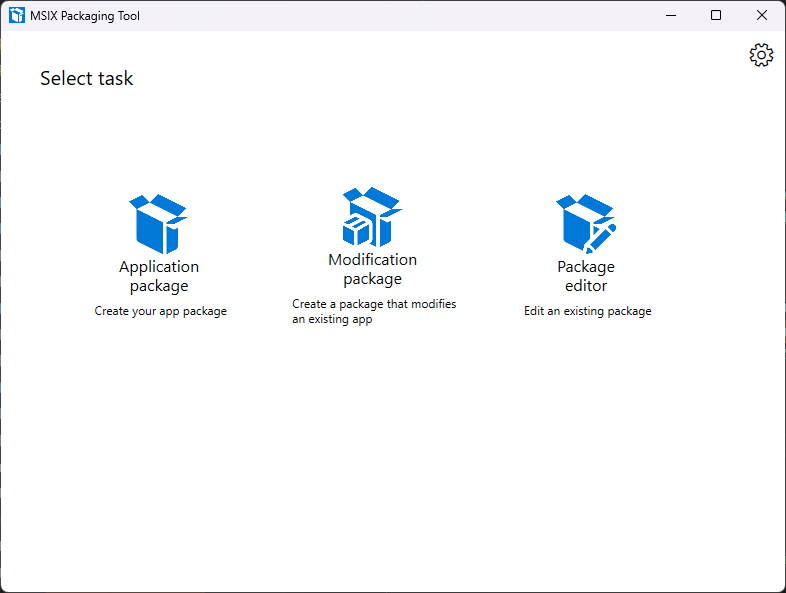
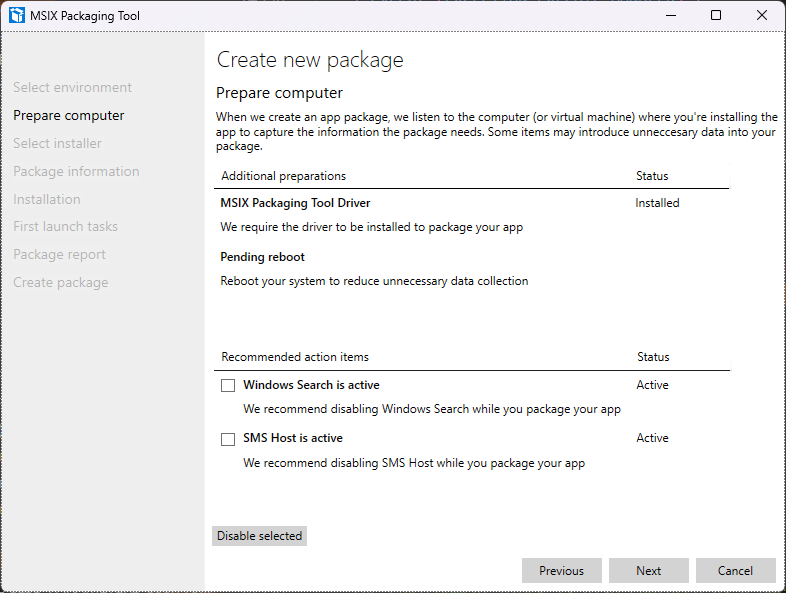
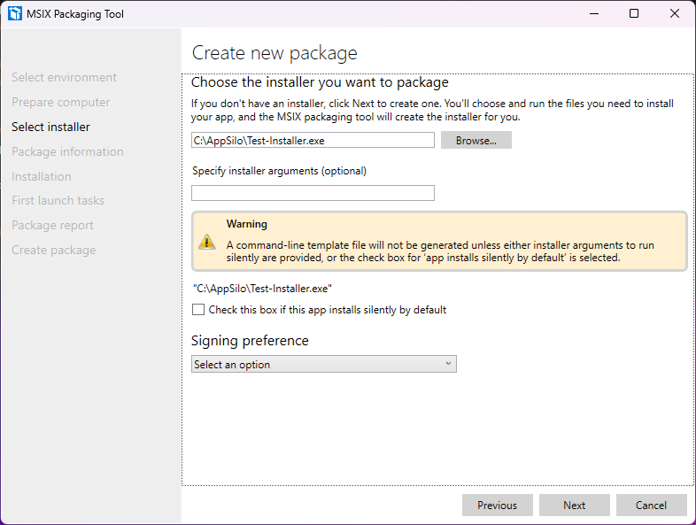
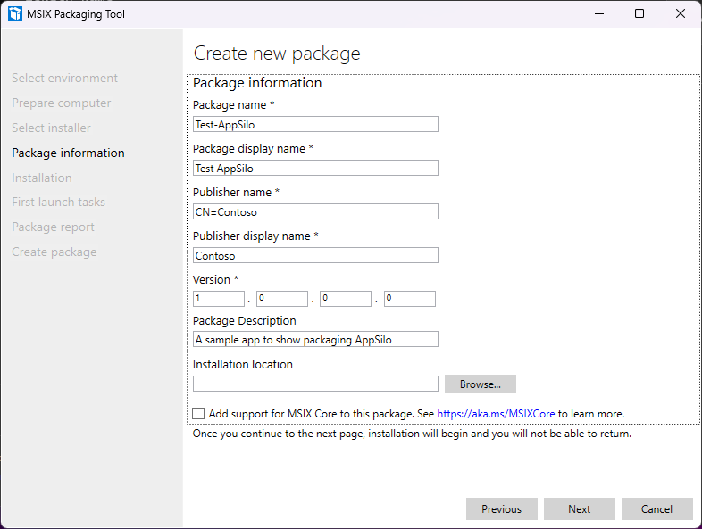
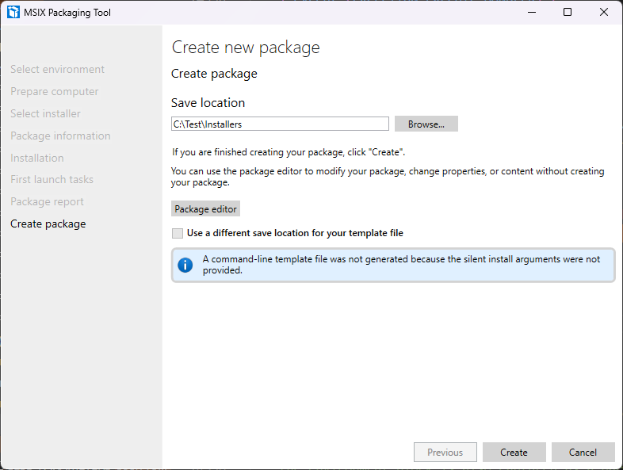
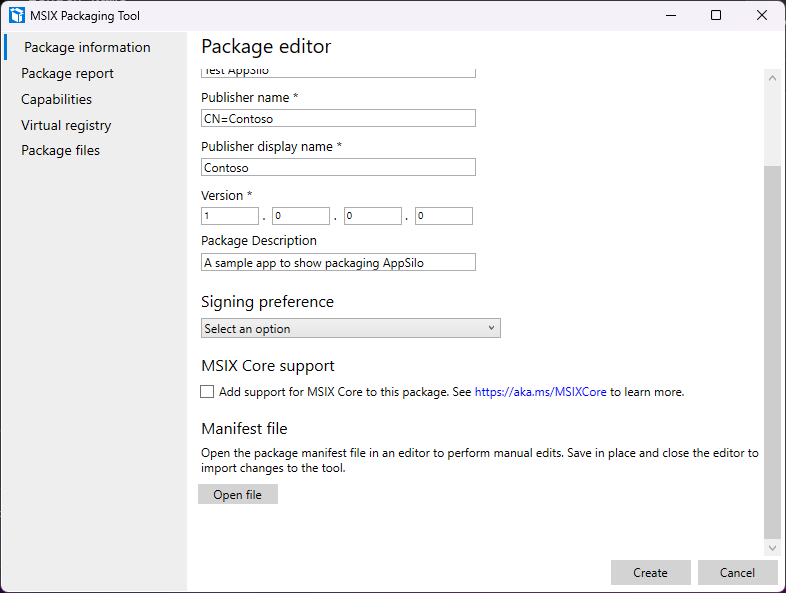
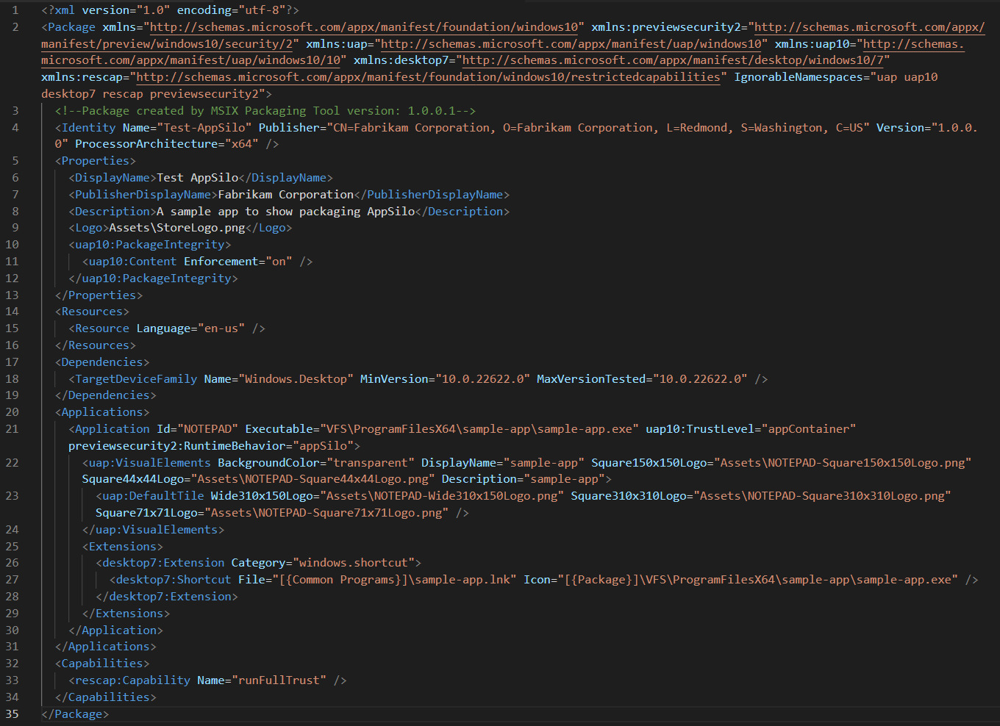

# Table of Contents

1. [将现有的 win32 安装程序转换为 .msix 应用程序](#Win32-->-msix)

2. [将现有的 .msix 应用程序转换为隔离的 Win32 应用程序](#MSIX-->-Isolated-Win32)

## 概述

本页面将介绍将现有的 MSIX 或 win32 应用程序打包为隔离的 Win32 应用程序所需的所有内容。这将通过 MSIX 打包工具 (MPT) 完成。**请注意**，支持 Win32 应用程序隔离的 MPT 版本为 v1.2023.517.0，可在此项目的发布资产中找到。[商店版本的 MPT](https://learn.microsoft.com/en-us/windows/msix/packaging-tool/tool-overview) 对于 Win32 应用程序隔离功能来说是**过时的**。您可以在此处找到 MPT 的其他文档 [here](https://learn.microsoft.com/en-us/windows/msix/packaging-tool/tool-overview)。

您可以在 github 的 [releases](https://github.com/microsoft/win32-app-isolation/releases) 部分找到 MPT 的下载以及分析器。

## Win32 -> MSIX

1. 在最左侧选择“应用程序包”，并选择要创建包的位置。此流程将遵循“在此计算机上创建包”选项。**请注意**，完成第 5 步后，这将导致应用程序安装为普通的 win32。

    

2. 等待“MSIX 打包工具驱动程序”字段完成检查

    

3. 使用浏览按钮导航到并选择 win32 安装程序。将签名首选项留空，因为我们需要编辑清单并再次签名。

    

4. 输入包信息。

    

5. 按照 win32 安装程序的常规步骤进行操作

6. 如果除主要入口点之外还有其他入口点，请启动或浏览到它们。如果应用程序在设置/配置/首选项中具有文件类型关联选项，请在此步骤中切换它们，以便 MSIX 可以识别它们。

7. 如果包中有服务，请重复相同的过程

8. 单击“创建”将包保存为完全信任的包。单击“包编辑器”按钮，从主菜单进入“包编辑器”流程。这可能需要几分钟，具体取决于包的大小。

    

## MSIX -> 隔离的 Win32

1. 选择最右侧的选项“包编辑器”，浏览到 .msix 文件，然后单击“打开包”按钮。

    

2. 滚动到“清单文件”部分，然后单击“打开文件”。

    

    在清单文件中，需要进行以下更改。

    **注意**：隔离的 Win32 应用程序与同一包中的其他应用程序类型不兼容。

    * 在 `<Package>` 元素中添加 `xmlns:previewsecurity2="http://schemas.microsoft.com/appx/manifest/preview/windows10/security/2"`

    * 在 `<Package>` 元素的末尾的 `IgnorableNamespaces` 中添加 `previewsecurity2`

    * 在 `<Dependencies>` 中将 `TargetDeviceFamily` 更改为 `<TargetDeviceFamily Name="Windows.Desktop" MinVersion="10.0.25357.0" MaxVersionTested="10.0.25357.0" />`

        * **注意**：并非所有功能都在最小版本中可用，请查看[发布说明](../../relnotes/windows-release-notes.md)以获取更详细的信息。

    * 在 `<Application>` 中，将任何现有的 entrypoint/trustlevel/runtimebehavior 替换为 `uap10:TrustLevel="appContainer" previewsecurity2:RuntimeBehavior="appSilo"`

    * **注意**：默认情况下，MPT 将自动将 `<rescap:Capability name="runFullTrust">` 添加到 `<Capabilities>` 中，因为应用程序是打包的 Win32。除非应用程序具有其他可以影响用户全局状态的清单扩展，例如 `comServer` 或 `FirewallRules`，否则应将其删除，因为这些扩展需要 `runFullTrust` 权限。

    

3. 应用程序可能需要其他功能才能正确运行，因为它已被隔离。

    这些功能直接将功能添加回隔离的应用程序。

    * `isolatedWin32-print` - 打印文档
    * `isolatedWin32-sysTrayIcon` - 显示来自系统托盘的通知
    * `isolatedWin32-shellExtensionContextMenu` - 显示基于 COM 的上下文菜单条目
    * `isolatedWin32-promptForAccess` - 提示用户访问文件
    * `isolatedWin32-accessToPublisherDirectory` - 访问以发布者 ID 结尾的目录

    这些功能允许应用程序最小限度地访问库，例如 MSVC 运行时或其他 Windows/第三方 DLL，适用于不支持提示的应用程序。

    * `isolatedWin32-dotNetBreadcrumbStore`
    * `isolatedWin32-profilesRootMinimal`
    * `isolatedWin32-userProfileMinimal`
    * `isolatedWin32-volumeRootMinimal`

4. 保存并关闭清单窗口。如果清单中有任何错误，MPT 将显示它们。选择“创建/保存”以生成 .msix 文件。这可能需要几分钟，具体取决于包的大小。

5. 有关识别可能需要在应用程序包清单中声明的功能的信息，请参见[应用程序功能分析器](../profiler/application-capability-profiler.md)。
