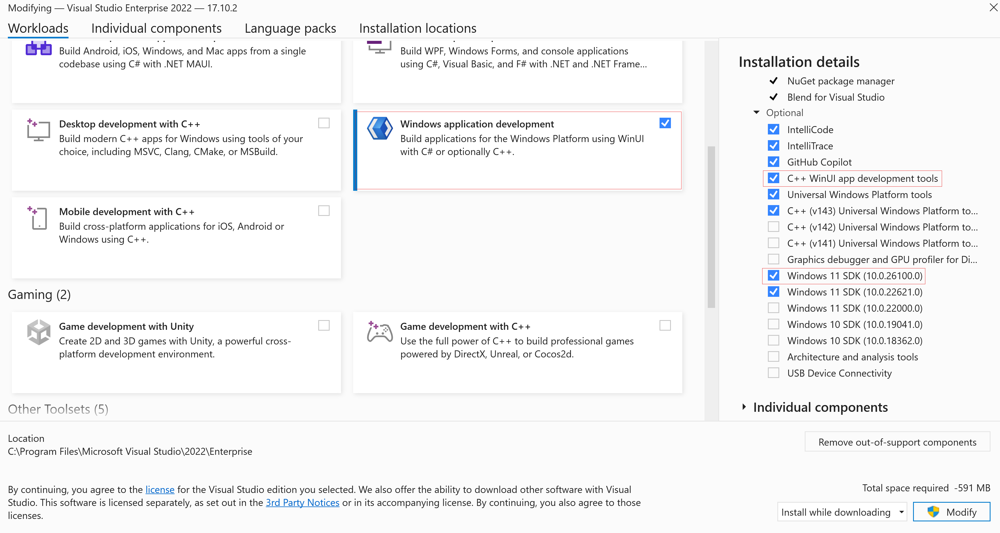
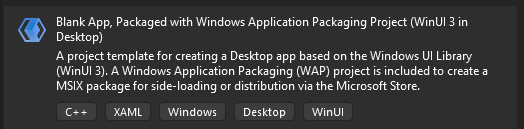
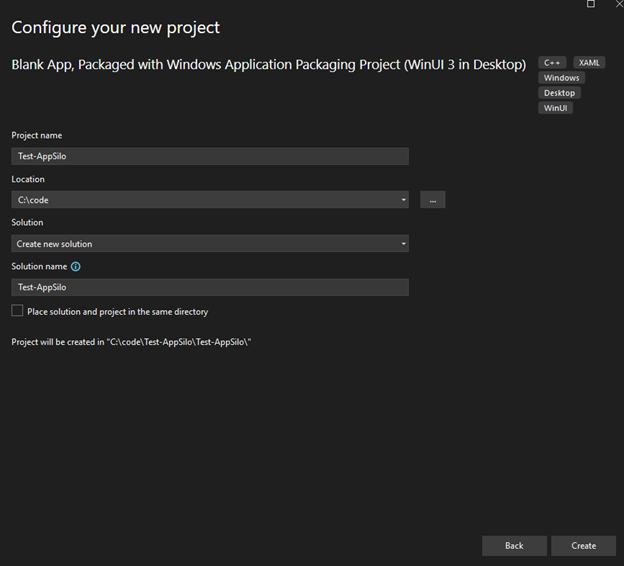
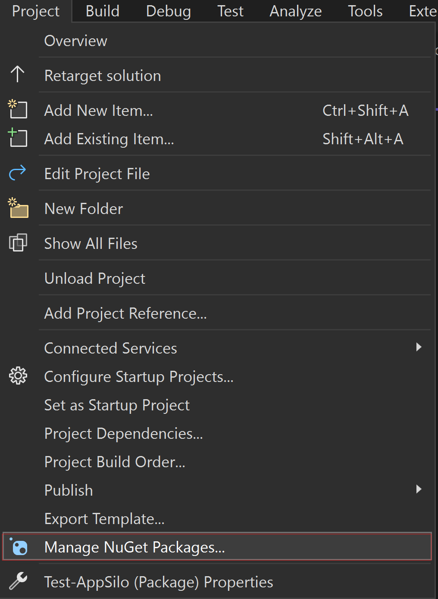
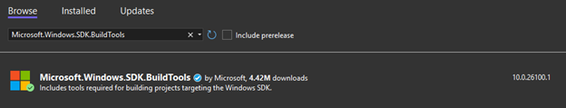
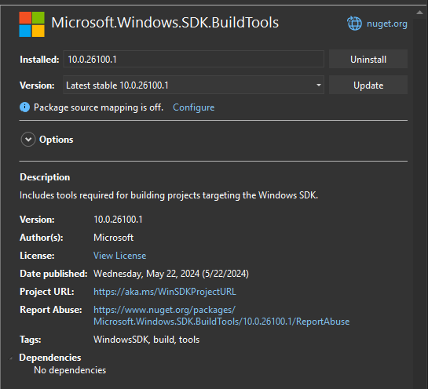
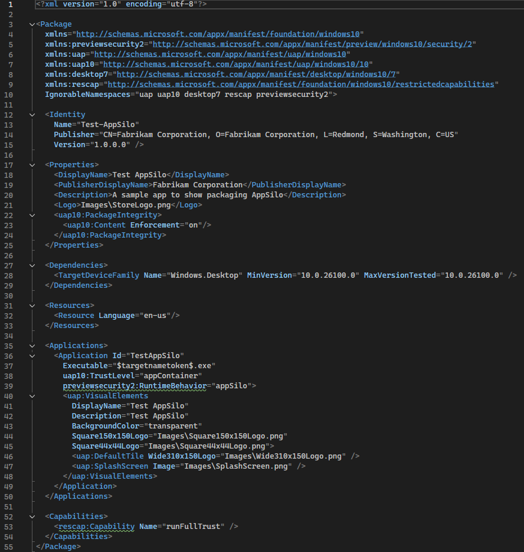
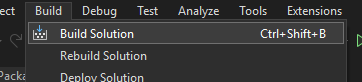
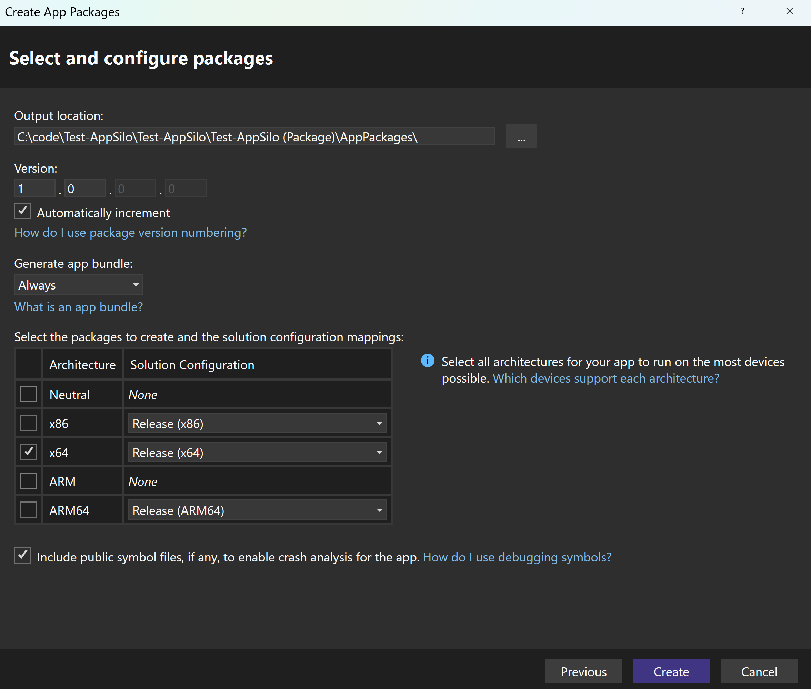
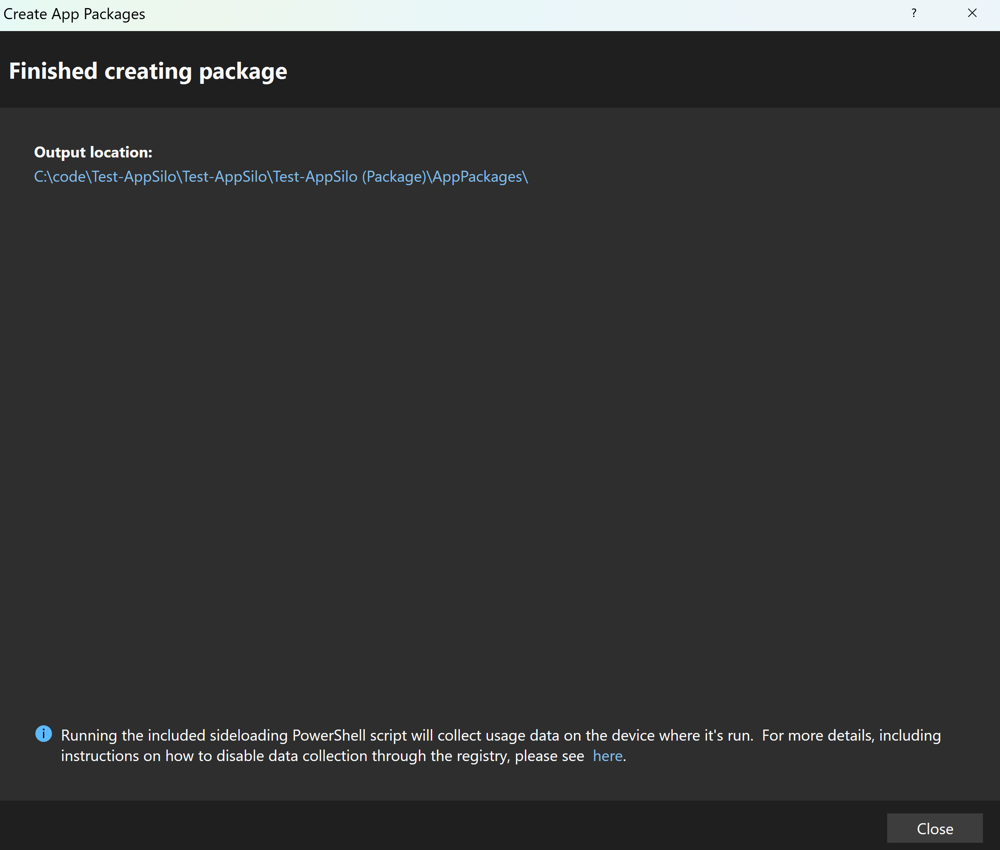

## Overview
This page will cover everything needed to package an application into an isolated Win32 app. 

## Required software pre-requisites:
* **Visual Studio** version 17.10.2 or higher

## Step 1 - Install the required workloads in Visual Studio including Windows 11 SDK 10.0.26100.0 (or greater)
Open the Visual Studio Installer and Modify the existing installation. 
On the Workloads tab check the *Windows application development* box
(and optionally check the *C++ WinUI app development tools* box for development in C++). 
The *Windows 11 SDK 10.0.26100.0* (or greater) is also required.

## Step 2 - Create your app project
In Visual Studio, create a new C# or C++ project using the template *Blank App, 
Packaged with Windows Application Packaging Project (WinUI 3 in Desktop)*. 
Click *Create* and then select *10.0.26100.0* (or later) for Target Platform Version (TPV) 
and Target Platform Minimum Version (TPMinV). 

## Step 3 - Install Microsoft.Windows.SDK.BuildTools version 10.0.26100.1 or later with NuGet
Go to *Project -> Manage NuGet Packages* to install *Microsoft.Windows.SDK.BuildTools* 
version 10.0.26100.1 (or later).

## Step 4 - Edit the Packaging.appxmanifest file
In the manifest file, the following changes will need to be made:

**Note**: Isolated win32 applications are not compatible with other application types within the same package.

* Add `xmlns:previewsecurity2="http://schemas.microsoft.com/appx/manifest/preview/windows10/security/2"`
to the `<Package>` element if it's not there already.

	* Add `previewsecurity2` to `IgnorableNamespaces` at the end of the `<Package>` element.

* Add `xmlns:uap10="http://schemas.microsoft.com/appx/manifest/uap/windows10/10"` to the `<Package>` element
if it's not there already.

	* Add `uap10` to `IgnorableNamespaces` at the end of the `<Package>` element.

* In `<Dependencies>` change `TargetDeviceFamily` to
`<TargetDeviceFamily Name="Windows.Desktop" MinVersion="10.0.26100.0" MaxVersionTested="10.0.26100.0" />`.

	* **Note**: Not all features are available in the minimum build, check out the [release notes](../../relnotes/windows-release-notes.md) for more detailed information.

* In `<Application>` replace any existing entrypoint/trustlevel/runtimebehavior with
`uap10:TrustLevel="appContainer" previewsecurity2:RuntimeBehavior="appSilo"`.

* In `<Application>` extensions, remove any `EntryPoints=*` or `Executable=*` as those are inherited from the parent `<Application>`

* Add `desktop7:Scope="user"` to the extension element for `windows.protocol`.

* **Note**: By default, Visual Studio will automatically add `<rescap:Capability name="runFullTrust">` to
`<Capabilities>` due to the app being a packaged Win32. This should be removed unless
the app has other manifested extensions which can affect the user global state, such as
`comServer` or `FirewallRules`, since those require the `runFullTrust` capability.

## Step 5 - Build and Publish App Packages
Build the Visual Studio solution. 

Publish the App Package by using the *Create App Packages...* wizard.

After publishing the App Packages, the *Output location* displayed shows the root directory 
where the MSIX package is published by version. 
Open on the version folder to find the Install.ps1 file for installing the app.

