# Application capability profiler (ACP)

## Overview

Packaged applications may need to access resources outside of the sandbox. Examples of such resources include user files, pictures, registry items, camera, location, and microphone, among others. [Capability declaration](https://learn.microsoft.com/en-us/windows/uwp/packaging/app-capability-declarations) allows sandboxed applications to access some of those resources. Declarations are made in the sandboxed application's package manifest. See [msix-packaging-tool](../packaging/msix-packaging-tool.md) for reference.

Application capability profiler is a set of tools that help identify what capabilities may need to be declared by an application package, so it's granted the resource access it needs. Furthermore, it provides useful diagnostic information on failed access attempts by the application package.

## Profiling step 0: set up the target system for profiling

#### 1. Ensure administrator privilege to the target Windows system is held.

#### 2. Enable developer mode on the target system. Settings &gt; Privacy & security &gt; For developers

#### 3. Install PowerShell 7

See [Installing PowerShell on Windows](https://learn.microsoft.com/en-us/powershell/scripting/install/installing-powershell-on-windows?view=powershell-7.3) for instructions.
This is required for [Microsoft.Windows.Win32Isolation.ApplicationCapabilityProfiler](reference/Microsoft.Windows.Win32Isolation.ApplicationCapabilityProfiler.md) module compatibility.

#### 4. Install Windows Performance Recorder (WPR) if not already installed and add it to PATH.

See [Windows Performance Recorder](https://learn.microsoft.com/en-us/windows-hardware/test/wpt/windows-performance-recorder) for instructions.

```PowerShell
Get-Command wpr
```

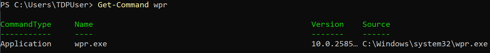

#### 5. Download the application capability profiler archive and extract it to a convenient path.

The application capability profiler archive can be downloaded from this project's [release assets](https://github.com/microsoft/win32-app-isolation/releases).

#### 6. Follow the instructions on [msix-packaging-tool](../packaging/msix-packaging-tool.md) to package the application and install it on the target system.

#### 7. Obtain the target application package manifest (recommended) and/or the target application package full name.

1. **(Recommended)** Obtain the target application package manifest. The easiest way to do this is to open it using the [MSIX packaging tool](../packaging/msix-packaging-tool.md) and save a copy of the manifest to a convenient path.

    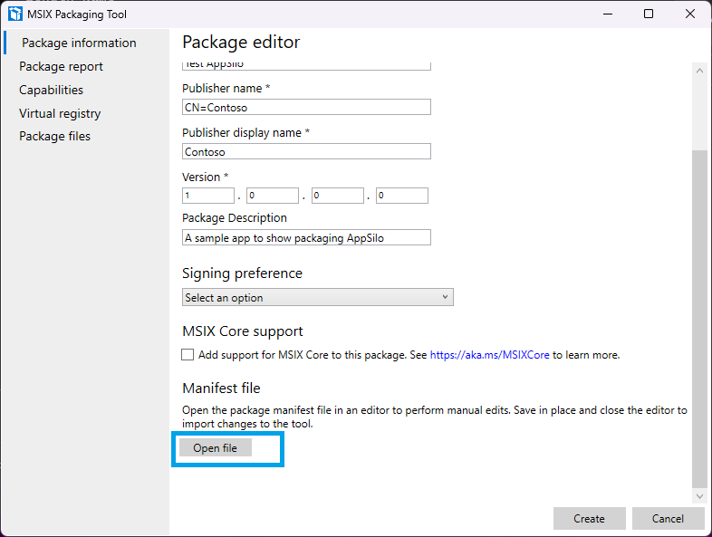
    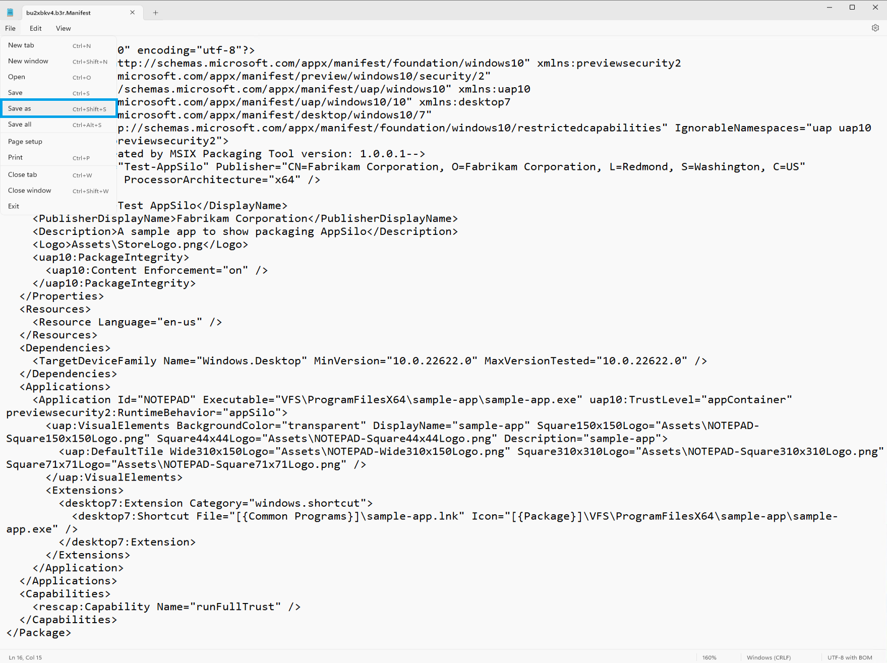
    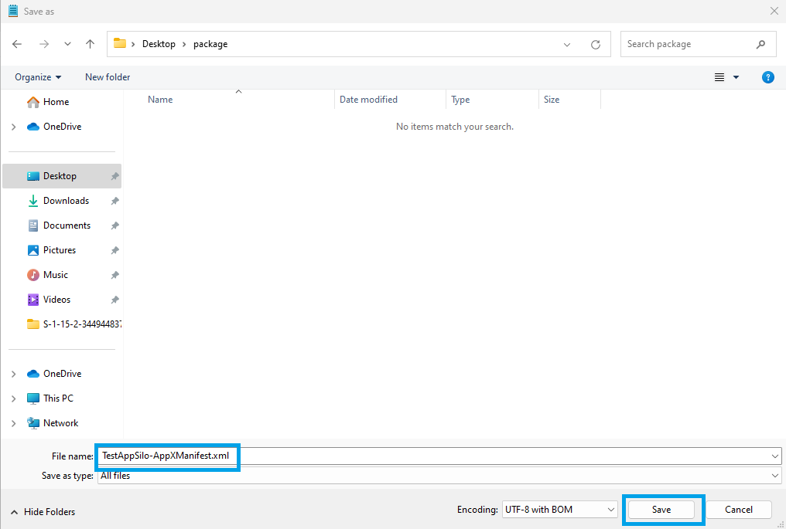

2. Obtain the application package full name.

    ```PowerShell
    Get-AppxPackage | where-object {$_.name -like '*Test-AppSilo*'}
    ```

    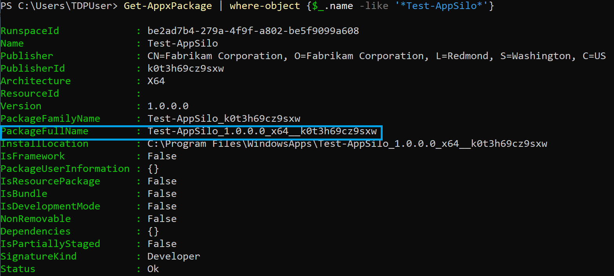

#### 8. **(Optional)** Install the Windows Performance Analyzer.

See [Windows Performance Analyzer](https://learn.microsoft.com/en-us/windows-hardware/test/wpt/windows-performance-analyzer) for instructions. This is not required for profiling but may be helpful in visualizing some of the data captured and output by ACP.

## Profiling step 1: import the PowerShell module

Module: [Microsoft.Windows.Win32Isolation.ApplicationCapabilityProfiler](reference/Microsoft.Windows.Win32Isolation.ApplicationCapabilityProfiler.md)

In administrator PowerShell 7:

```PowerShell
Import-Module .\Microsoft.Windows.Win32Isolation.ApplicationCapabilityProfiler.dll
```

*Note:* the Microsoft.Windows.Win32Isolation.ApplicationCapabilityProfiler.dll module is located in the ACP folder extracted from the archive in step 0.5 above.

## Profiling step 2: Start-Profiling

The Start-Profiling cmdlet takes the path to the target application package manifest or the full name of the application package.
Start-Profiling will instrument the target application package for trace logging and enable a trace logging provider for access attempts made by the target application package.
Start-Profiling requires administrator privileges and that Developer Mode be enabled. See [Start-Profiling](reference/Start-Profiling.md) for details.

```PowerShell
Start-Profiling -ManifestPath TestApp-AppXManifest.xml

```

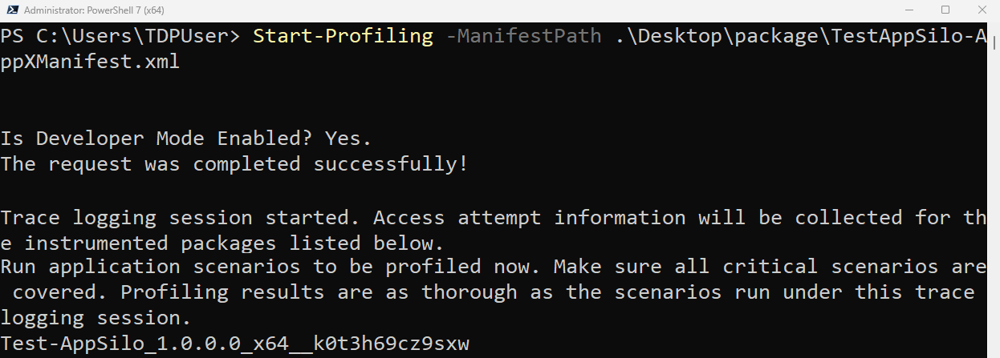

## Profiling step 3: run the application scenarios

In this step, it is important that all the critical application scenarios are run. Profiling results are as comprehensive as the scenarios run at this step. The more application scenarios are exercised, the larger and more complete the amount of data captured by the trace logging session started above.

## Profiling step 4: Stop-Profiling

The Stop-Profiling cmdlet stops an access attempt trace logging session that has been started and takes away the instrumentation for any application packages that had been instrumented for trace logging.
Stop-Profiling takes an optional trace path parameter that controls the path used for the output Event Trace Log (.etl) file. &lt;current_directory&gt;\trace.etl by default.
Stop-Profiling requires administrator privileges and that Developer Mode be enabled. See [Stop-Profiling](reference/Stop-Profiling.md) for details.

```PowerShell
Stop-Profiling
```

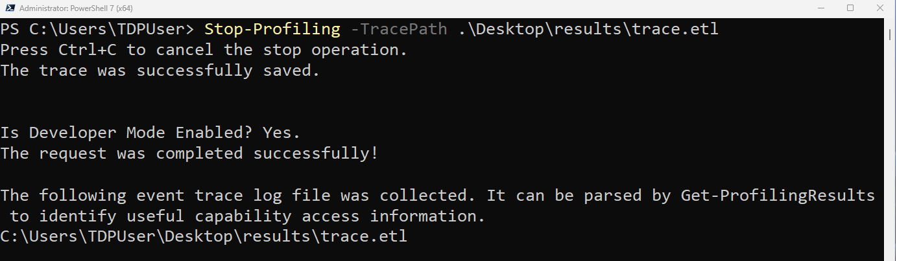

## Profiling step 5: Get-ProfilingResults

The Get-ProfilingResults cmdlet parses the trace file obtained from the steps above and finds the capabilities the application package(s) identified in the trace require. It outputs capabilities and information for every application package identified in the trace, unless filtering to a specific package is specified.

Get-ProfilingResults takes in the path to the trace file to parse. If none is provided, Get-ProfilingResults will attempt to Stop-Profiling to obtain a trace to parse.
Get-ProfilingResults optionally takes a path to a target application manifest. If information in the parsed trace can be attributed to the target application package manifest, the file is edited directly with the output capabilities. Otherwise, a copy of the manifest is made for each of the packages identified in the trace and their identified capabilities.

See [Get-ProfilingResults](reference/Get-ProfilingResults.md) for details.

```PowerShell
Get-ProfilingResults -EtlFilePaths trace.etl -ManifestPath TestApp-AppXManifest.xml

```

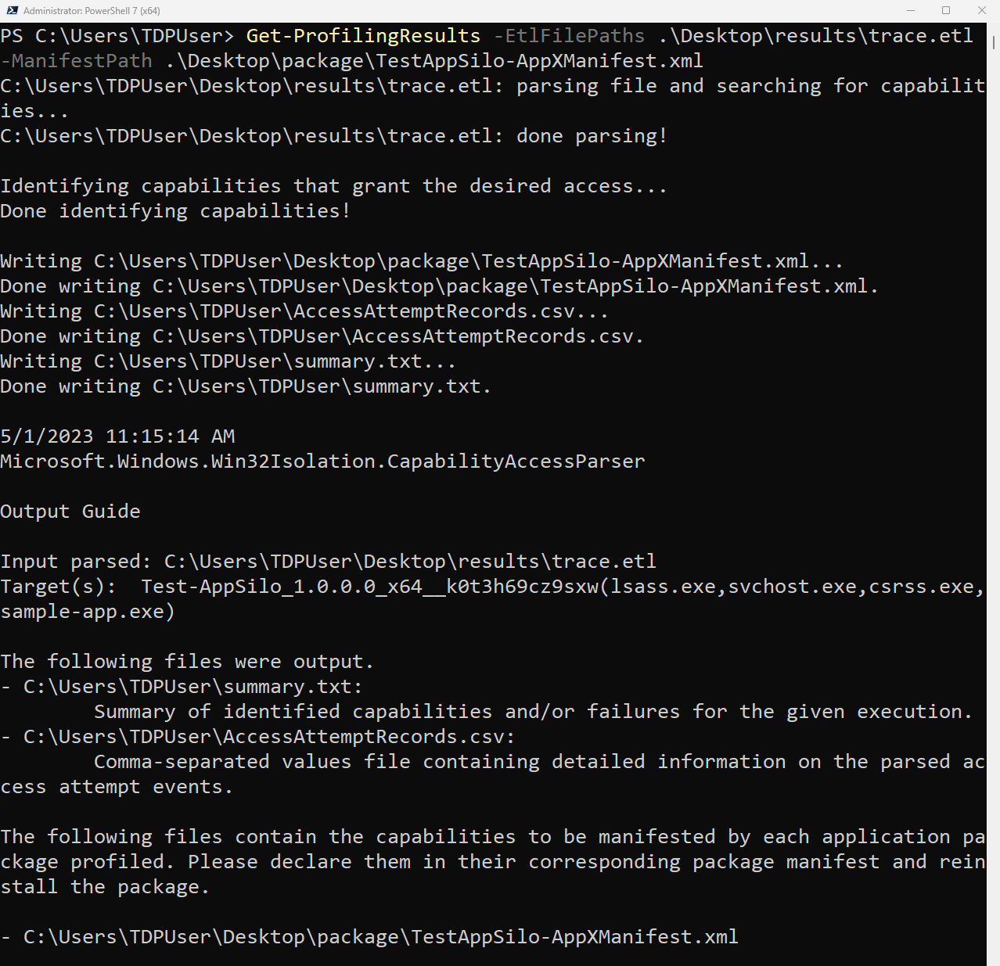

## Profiling step 6: repackaging

1. Include the newly identified capabilities in the target application package manifest (Get-ProfilingResults will edit the manifest directly if provided).
2. Follow instructions in [msix-packaging-tool](../packaging/msix-packaging-tool.md) to repackage the target application with the new capabilities, and reinstall it.

## Helper cmdlets

The [Merge-ProfilingResults](reference/Merge-ProfilingResults.md) cmdlet can be used to merge the output from multiple runs of Get-ProfilingResults.

## Interpreting Get-ProfilingResults output

1. Manifest-formatted capabilities

    If the user provides a manifest to be edited under the -ManifestPath option **and** if the package to which the manifest pertains is identified in the input trace, Get-ProfilingResults will edit the manifest file directly to include the capabilities identified in the trace for the package. Otherwise, for each package identified in the trace file, Get-ProflingResults will output a file named &lt;package full name&gt;\<manifest name>.xml containing the &lt;Capabilities&gt; element with the capabilities identified in the trace for the corresponding package.

    **Note**: there are two special kinds of capabilities Get-ProfilingResults may identify. These are flagged with XML comments in the output manifest.
    * Privacy-sensitive capabilities: these capabilities protect privacy-sensitive resources such as camera, location, and microphone. These capabilities must be declared if the application package requires access to these resources. However, capability declaration alone may not be sufficient to ensure application access to the target privacy-sensitive resource. In privacy settings, the user can still grant or deny resource access to the application.
    * Prompting capability: Get-ProfilingResults will output this capability in "commented-out" form when it identifies that the prompting capability may apply to an application package. If declared in ("uncommented" from) the package manifest, the application is opted **into** fallback prompting. User prompts will be issued every time the application hits access denied to a prompting-eligible resource. This gives the user a chance to explicitly grant or deny access to the resource. Fallback prompting can be intrusive and weaken the sandbox, so it should be used with caution, preferably only when required for critical application scenarios.

2. AccessAttemptRecords.csv

    This is a comma separated values file containing detailed diagnostic information on parsed trace events and each failed access attempt logged for the application package.

3. summary.txt

    This is a summary of all runs of Get-ProfilingResults. Each run appends to this file. -SummaryOutputPath can be used to control this filepath.

    The summary contains the inputs parsed, target application packages and executables, identified capabilities, edited manifest contents and a summarized list of all the resources that the application package attempted to access but for which no capabilities were identified. **Note** that it may be that the target application will be unable to access these resources when packaged.

4. README.txt

    Output guide for all runs of Get-ProfilingResults. Each run appends to this file.

    README brings information on the input parsed, target application package, files output and their paths, as well as troubleshooting guide.

## Stack Tracing - ACP-StackTrace.wpaProfile

The ACP archive contains a file named ACP-StackTrace.wpaProfile. This is a profile for Windows Performance Analyzer (WPA). It enables stack trace visualization for the event trace log file captured by Stop-Profiling. It breaks down access attempts, their target, and the stack that issued the attempt. This enables a more complete understanding of the reasons why the target application is not able to access certain resources.

To visualize access attempt stacks captured by Stop-Profiling in "trace.etl":
1. Open trace.etl in WPA.
2. Configure WPA Symbol paths to point to the application symbols and the Microsoft public symbol server.

    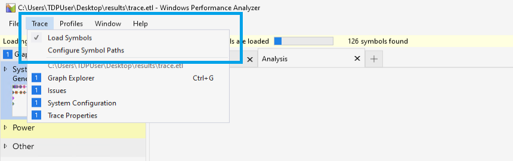

3. Load symbols.
4. Apply the ACP-StackTrace.wpaProfile to bring up the access attempt stack visualization.

    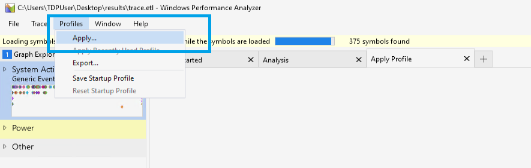
    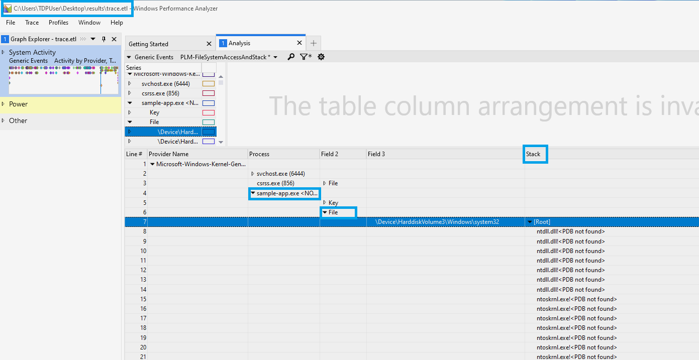

See [Windows Performance Analyzer](https://learn.microsoft.com/en-us/windows-hardware/test/wpt/windows-performance-analyzer) for details.

## RELATED LINKS

[Microsoft.Windows.Win32Isolation.ApplicationCapabilityProfiler](reference/Microsoft.Windows.Win32Isolation.ApplicationCapabilityProfiler.md)

[Start-Profiling](reference/Start-Profiling.md)

[Stop-Profiling](reference/Stop-Profiling.md)

[Get-ProfilingResults](reference/Get-ProfilingResults.md)

[Merge-ProfilingResults](reference/Merge-ProfilingResults.md)

[msix-packaging-tool](../packaging/msix-packaging-tool.md)

[Capability declaration](https://learn.microsoft.com/en-us/windows/uwp/packaging/app-capability-declarations)

[Windows Performance Recorder](https://learn.microsoft.com/en-us/windows-hardware/test/wpt/windows-performance-recorder)

[Windows Performance Analyzer](https://learn.microsoft.com/en-us/windows-hardware/test/wpt/windows-performance-analyzer)

[Installing PowerShell on Windows](https://learn.microsoft.com/en-us/powershell/scripting/install/installing-powershell-on-windows?view=powershell-7.3)